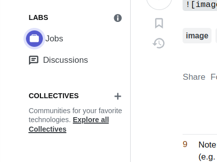

# This is Markdown
## new world


HOW TO WRITE NORMAL TEXT:

Markdown will treat a new line as if it's just a space, so you have to seperate your paragraphs or when you want a new line by a line.

test is __bold__ **bold as well**
text is ***italics and bold***
__*bold*__ and italics
~~crossed off~~
~crossed off~
==highlight== but not supported by github version of markdown
<mark color = 'red'>highlighed</mark>
<mark style = "background-color: red;">highlighed</mark>

X<sup>2</sup> MATHS and H<sub>2</sub>O      CHIMIE
:smile
🇺🇸

`This is code`

`int var = 10`

`char **argv`
```c
int str_len(char *str)
{
    int i;

    i = 0;
    while(str[i])
    {
        i++;
    }
    return i;
}
```

```c
int main(void)
{
    string name = "John Doe";
    cout << name;
}
```

[link to Google](https://google.com)

<https://google.com>


- item 1
- item 2
- item 3

1. Usin Bolt
2. Mike Trouce
3. Klaus Ptarmegan

> This is a blockquote

> Another quote

| column 1 | column 2 |
| :--------: | --------: |
| Data     | data 2   |
| hdf      | kljdfd |
| ljkdfjd | ljsdf|
|kljksf|kljdf|

****
new
****
line
****
hit it


| 1 | 2 |
| :- | -: |
| a | b |
| c | d |

| - | - |

- [ ] unchecked item
- [x] checked one

[ ] what

[X] not

- [ ] what
- [x] not

